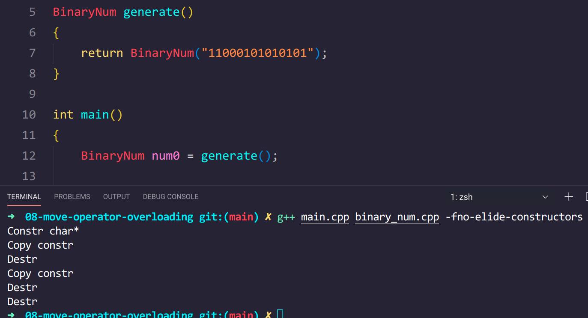

# Класове - голяма петица, предефиниране на оператори

### [Задача](#задача)

&nbsp;
## Move semantics

### `lvalue`, `rvalue`
- `lvalue` – обект, съществуващ в паметтa; има свой адрес
- `rvalue` – обект, който не притежава собствен адрес; има кратък живот

Можем да имаме референции към двата типа:
- `lvalue reference` – референция към `lvalue` (`ClassName&`)
- `rvalue reference` – референция към временен обект (`ClassName&&`)

&nbsp;
### **Move конструктор**
```cpp
ClassName(ClassName&& other) noexcept;
```
| Move конструктор |
| --- |
| 1. Метод за избягване на (възможно бавно) копиране от друг обект, който скоро ще се изтрие. |
| 2. Няма тип на връщане. |
| 3. Приема `rvalue reference`. |
| 4. Предава член данните от временния към новия обект. |
| 5. Оставя временния обект във **валидно състояние**, такова че деструкцията му **няма да повлияе** на новия обект. |
| [Документация](https://en.cppreference.com/w/cpp/language/move_constructor) |
&nbsp;
### **Move оператор за присвояване**
```cpp
ClassName& operator=(ClassName&& other) noexcept;
```
| Move оператор = |
| --- |
| 1. Метод за избягване на (възможно бавно) копиране от друг обект, който скоро ще се изтрие. |
| 2. Приема `rvalue reference`. |
| 3. Предава член данните от временния към този, на който се присвоява. |
| 4. Връща референция към обекта, на който се присвоява. |
| 5. Оставя временния обект във **валидно състояние**, такова че деструкцията му **няма да повлияе** на обекта, на който се присвоява. |
| [Документация](https://en.cppreference.com/w/cpp/language/move_assignment) |

&nbsp;

**[`std::move`](https://en.cppreference.com/w/cpp/utility/move)** – служи за вземане на `rvalue reference` от обект

Ето какъв е резултатът при:

- деактивиран [return value optimization](https://en.wikipedia.org/wiki/Copy_elision#Return_value_optimization)
и недефиниран `move`:


- деактивиран RVO и дефиниран `move`:


- активиран RVO (по подразбиране):


&nbsp;

## Предефиниране на оператори
Можем да дефинираме какво се случва, когато използваме някакъв познат оператор върху обекти от наш клас.

[Документация](https://en.cppreference.com/w/cpp/language/operators)

&nbsp;

## Задача

**Зад. 1.**

Като програмисти, често ни се налага да работим с двоични числа.
За да си помогнем, ще си направим клас за работа с такива.

Създайте клас `BinaryNum`, който да има:
- конструктор по подразбиране, който инициализира числото със стойността нула;
- конструктор, приемащ символен низ
  - този конструктор трябва да 'взема' двоичните цифри от първото срещане на единица в подадения низ, до последната валидна бинарна цифра
- голяма петица
- предефинира следните оператори:
  - '`==`' – връща дали две числа са равни;
  - '`!=`' – връща дали две числа не са равни;
  - '`&`' – връща побитово `AND` на две числа;
  - '`|`' – връща побитово `OR` на две числа;
  - '`^`' – връща побитово `XOR` на две числа;
  - '`+`' – връща сбора на две числа;
  - '`<<`' – преместване надясно;
  - '`>>`' – преместване наляво;
  - '`<<`' – извеждане в поток;
  - '`>>`' – въвеждане от поток;

**Зад. 2.** Реализирайте клас `IntegerSet` за работа с множества от цели числа.

`get_size()` - връща големината на множеството.

Да се реализират следните операции:
- `==`
  - връща дали две множества имат еднакви елементи;
- `!=`
  - връща обратното на '`==`';
- `+`
  - връща обединението на две множества;
- `+=`
  - запазва обединението на две множества в първото;
- `-`
  - връща разликата на едно множество с друго;
- `symmetric_difference()`
  - връща симетричната разлика на две множества;
- `*`
  - връща сечението на две множества;
- `<<`
  - извежда всички елементи на множеството в къдрави скоби и разделени със запетайки.
