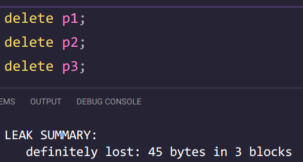
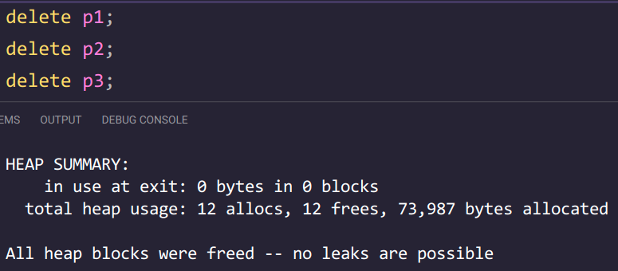

# Полиморфизъм

## Въведение

*поли* - много</br>
*морфо* - форми

**`virtual`**: декларирането на метод като виртуален позволява той да бъде предефиниран в производните класове.

Правила:
1. Виртуалните функции не могат да бъдат статични.
2. Прототипът на виртуален метод трябва да бъде един и същи в базовия и наследения клас.
3. Виртуалните методи се дефинират в базовия клас. В производните класове те се предефинират, ако
   е нужно. Ако метод не е предефиниран в класа-наследник се използва базовата му дефиниция.
4. Клас може да има виртуален деструктор, но не и виртуален конструктор.

## Пример
```cpp
class Customer
{
protected:
    double membership_fee;
public:
    Customer() : membership_fee(20) {}
    double get_membership_fee() { return membership_fee; }
};

class PremiumCustomer : public Customer
{
public:
    PremiumCustomer() : Customer() {}
    double get_membership_fee() { return membership_fee / 2; }
};

int main()
{
    Customer* c1 = new Customer();
    Customer* p1 = new PremiumCustomer();
    std::cout << c1->get_membership_fee() << '\n';      // What will it print?
    std::cout << p1->get_membership_fee() << '\n';      // What will it print?
}
```

```cpp
class Customer
{
    double membership_fee;
public:
    Customer() : membership_fee(20) {}
    virtual double get_membership_fee() { return membership_fee; }
};

class PremiumCustomer : public Customer
{
public:
    PremiumCustomer() : Customer() {}
    double get_membership_fee() override { return membership_fee / 2; }
};

int main()
{
    Customer* c1 = new Customer();
    Customer* p1 = new PremiumCustomer();
    std::cout << c1->get_membership_fee() << '\n';      // What will it print?
    std::cout << p1->get_membership_fee() << '\n';      // What will it print?
}
```

## Типове полиморфизъм

| Compile time polymorphism | Runtime polymorphism |
| --- | --- |
| Също се нарича **статично свързване** | Също се нарича **динамично свързване** |
| Чрез *function overloading* и *operator overloading* | Чрез *method overriding* |
| Осъществява се по време на **компилация** | Осъществява се по време на **изпълнение** |
| **Няма** отражение въхру производителността | **Има** отражение върху производителността |

&nbsp;

:question: Кой тип според вас дава по-големи възможности?

:exclamation: *overloading* vs *overriding*:
- *overloading* – позволява да съществува функция с едно и също име,
  но различен брой и/или тип параметри.
- *overriding* – предефиниране на метод в производен клас. Има същата сигнатура
  като метода на базовия клас - същия тип на връщане и параметри.

## Абстрактен клас
Клас, който има поне една чисто виртуална (*pure virtual*) член-функция.

:warning: ~~Чисто виртуален метод е такъв без дефиниция в базовия клас.~~

Може чисто виртуален метод да има дефиниция. Това, което
[отличава](https://en.cppreference.com/book/intro/abstract_classes)
чисто виртуалните методи е, че производните класове **задължително**
трябва да ги предефинират.

Декларация на чисто виртуална функция:
```cpp
virtual /*return type*/ method(/*parameters*/) = 0;
```

Ако в производния клас някой от чисто виртуалните методи не бъде
предефиниран, производният клас също ще бъде абстрактен.

:exclamation: Не могат да се създават обекти от абстрактен клас.

## Виртуален деструктор
При полиморфична архитектура, най-вероятно деструкторът
в базовия клас трябва да бъде виртуален.

В противен случай, ако чрез указател/референция с тип базовия клас
освободим даден обект от тип производен клас, ще се извика
само конструкторът на базовия клас.

**Пример**: Класът `Pen` – наследник на `ItemWithQuantity` от задача 2
има свой деструктор, който освобождава паметта за динамичния низ, който съдържа.

`p1`, `p2` и `p3` са от тип `ItemWithQuantity*`, но съдържат информация за `Pen`.

Ако изпълним `main` и:
- деструкторът на `ItemWithQuantity` **не е** виртуален:

  

- деструкторът на `ItemWithQuantity` **е** виртуален:

  

Извод: правете деструктора на базовия клас виртуален.
Дори той самият да е празен, важно е да бъде виртуален.

## Задачи

1. Създайте опростен калкулатор, при който:
- Всяка константа е израз.
- Всичко от вида -(израз) е израз.
- Всичко от вида (израз)^(константа) е израз.
- Всичко от вида (израз + израз) е израз.
- Всичко от вида (израз * израз) е израз.

Трябва да има метод evaluate(), който позволява да се намери стойността на подаден израз.

2. Създайте система за склад. В склада има информация за всички продукти, които има в него. Продуктите са различни типове - химикалка, тетрадка, гумичка, панделка..., но всеки от тях има име, цена и количество. Складът трябва да поддържа следните функционалности:
- зареждане на количество от даден продукт
- продаване на количество от даден продукт
- намиране на общата цена на всички продукти
- принтиране на статистика за количеството на всеки продукт

Цената на химикалка се определя по:
- количество мастило (ml) * цена на ml

**Забележка 1:** Добавено е име на обекта - низ с произволна дължина.

**Забележка 2:** Добавен е още един динамичен низ в `Pen`, за да се демонстрира нуждата
от виртуален деструктор в `ItemWithQuantity`.

**За домашно:**
1. Да се добави голяма тройка (копи конструктор, оператор=, деструктор) където е необходимо.
2. Да се реализират следните продукти:
   - тетрадка
     - цената на тетрадка се определя по: брой листа * цена на лист
   - гумичка
     - със стандартна цена
   - панделка
     - цената на панделка се определя по: дължина на панделката (в метри) * цена на метър
